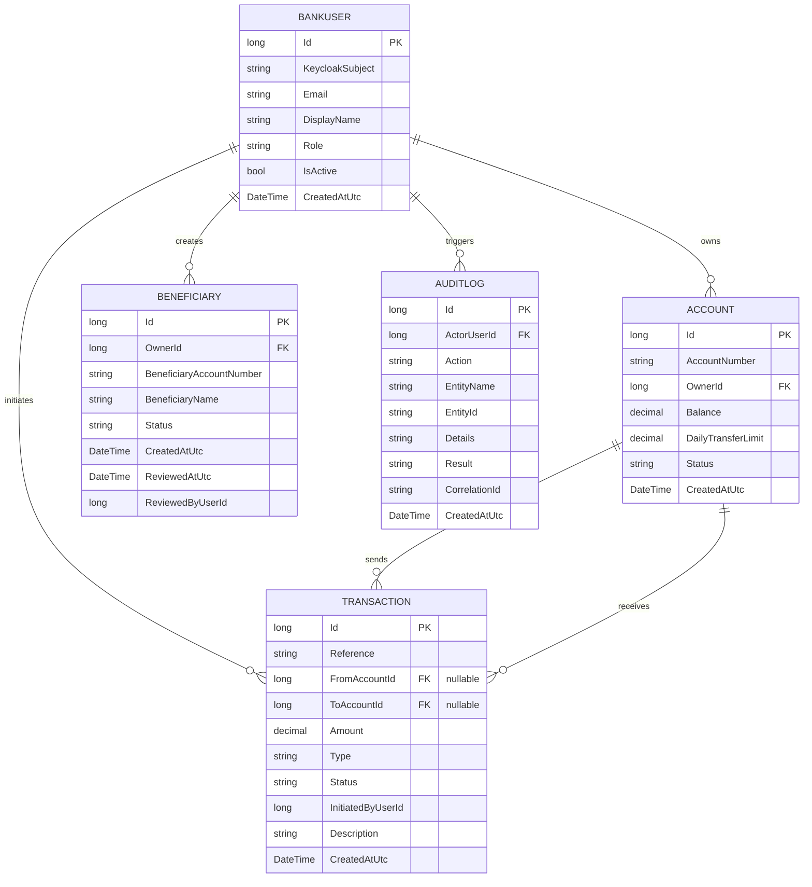

# Online Banking Simulation API

A .NET Web API implementing core online-banking functionality with Keycloak-based JWT authentication, Role-Based Access Control (RBAC), account creation, deposits, fund transfers, beneficiary management, transaction history, PDF statements, and full audit logging.

## Tech Stack
- **Backend Framework**: .NET / ASP.NET Core Web API (C#)
- **Data Access**: Entity Framework Core - Code-First approach
- **Database**: Microsoft SQL Server
- **Authentication**: Keycloak (JWT-based authentication)
- **Authorization**: Role-Based Access Control (RBAC)
- **PDF Generation**: iText7
- **Logging**: Serilog (structured logging)
- **API Documentation**: Swagger / OpenAPI
- **Architecture**: Layered architecture (Controllers -> Services -> Repositories -> DbContext)

## Project Structure
```text
BankingSimulation.Api       # Controllers, Services, DTOs, Middleware
BankingSimulation.Data      # Entities, DbContext, Repositories, Migrations
BankingSimulation.Tests     # Unit tests (xUnit + Moq)
```

## Setup & Configuration

### 1. Configure Keycloak
The API relies on Keycloak for authentication and authorization. Start Keycloak in dev mode:
```bash
kc.bat start-dev --http-port=8180
```
Then update the connection parameters in `BankingSimulation.Api/appsettings.json`:
```json
"Keycloak": {
  "AuthServerUrl": "http://localhost:8180",
  "Realm": "banking-application",
  "ClientId": "banking-app",
  "ClientSecret": "nfigtXX8pbEE0D2C4BEiAV1qSunRt5Xrdm9mktgR7bPJpfeKaADQ34vbBepasjAi8C3m197MljC8jMXa5NYKWc",
  "AdminClientId": "admin-cli",
  "AdminClientSecret": "PhWRJKEEWdzs8DXNmcNxJIQpgXtQAW82E3BWiRkR98SwZbaXiAAVg9rmbOhN6p2cNQDwqpKqJWMOcFKTErAywv"
}
```

### 2. Configure SQL Server
Update the database connection string in `BankingSimulation.Api/appsettings.json`:
```json
"ConnectionStrings": {
  "Default": "Server=localhost;Database=BankingSimulation;Trusted_Connection=True;Encrypt=False;TrustServerCertificate=True;"
}
```

For local development, `Encrypt=False` avoids SQL Server client encryption issues on machines without a configured SQL Server certificate. For production, use encryption with a valid trusted certificate.

### 3. Apply Migrations 
EF Core migrations are configured to run automatically on startup. However, you can also run them manually:
```bash
dotnet ef database update --project BankingSimulation.Data --startup-project BankingSimulation.Api
```

### 4. Run the API
```bash
cd BankingSimulation.Api
dotnet run
```
Swagger UI will be available at: `http://localhost:5000/swagger` (or the configured port).

### 5. Run Tests
```bash
dotnet test BankingSimulation.Tests
```

Current verification status:
- `dotnet test BankingSimulation.Tests\BankingSimulation.Tests.csproj --no-restore` passes.
- `dotnet build BankingSimulation.Api\BankingSimulation.Api.csproj --no-restore` passes.

## ER Diagram (Entity-Relationship)



## Seeded Credentials

| Role     | Email                | Password      |
|----------|----------------------|---------------|
| Admin    | admin@bank.com       | Admin@123     |
| Staff    | staff@bank.com       | Staff@123     |
| Customer | customer@bank.com    | Customer@123  |

On a fresh database, the seeded customer has two accounts: `ACC0000000001` (balance: 10,000) and `ACC0000000002` (balance: 2,500).

## Recent Features Added

- Account creation now generates globally unique account numbers from the saved database account ID, for example `ACC0000000003`.
- Login now re-links an existing local user by email if the Keycloak subject changes, avoiding duplicate email insert failures.
- Deposits are supported through a dedicated service and endpoint.
- Deposit operations create `Deposit` transactions, credit the target account, support idempotency keys, and write audit logs.
- Deposit business logic is kept in `DepositService` behind `IDepositService`, keeping controllers thin and following SOLID-friendly service boundaries.

## API Endpoints

### Auth
| Method | Endpoint           | Access  |
|--------|--------------------|---------|
| POST   | /api/auth/login    | Public  |
| POST   | /api/auth/signup   | Public  |
| POST   | /api/auth/refresh  | Public  |

### Accounts
| Method | Endpoint                        | Access        |
|--------|---------------------------------|---------------|
| POST   | /api/accounts/create            | Admin, Staff  |
| POST   | /api/accounts/{id}/deposit      | Admin, Staff  |
| GET    | /api/accounts/my                | Customer      |
| GET    | /api/accounts/{id}              | Admin, Staff  |
| GET    | /api/accounts                   | Admin, Staff  |
| PATCH  | /api/accounts/{id}/freeze       | Admin, Staff  |
| PATCH  | /api/accounts/{id}/unfreeze     | Admin, Staff  |

### Beneficiaries
| Method | Endpoint                            | Access        |
|--------|-------------------------------------|---------------|
| POST   | /api/beneficiaries                  | Customer      |
| GET    | /api/beneficiaries/my               | Customer      |
| GET    | /api/beneficiaries/pending          | Admin, Staff  |
| PATCH  | /api/beneficiaries/{id}/review      | Admin, Staff  |

### Transfers
| Method | Endpoint        | Access   |
|--------|-----------------|----------|
| POST   | /api/transfers  | Customer |

### Transactions
| Method | Endpoint                              | Access        |
|--------|---------------------------------------|---------------|
| GET    | /api/transactions/account/{accountId} | Customer      |
| GET    | /api/transactions                     | Admin, Staff  |

### Statements (PDF)
| Method | Endpoint         | Access    |
|--------|------------------|-----------|
| GET    | /api/statements  | All roles |

Query params: `accountId`, `from` (yyyy-MM-dd), `to` (yyyy-MM-dd)

## Request Body Examples

### Create Account
```http
POST /api/accounts/create
Authorization: Bearer <admin-or-staff-token>
Content-Type: application/json
```

```json
{
  "ownerId": 3,
  "dailyTransferLimit": 5000
}
```

Use the numeric `ownerId` of the user who should own the account. The API generates the `accountNumber` automatically.

### Deposit Money
```http
POST /api/accounts/1/deposit
Authorization: Bearer <admin-or-staff-token>
Content-Type: application/json
```

```json
{
  "amount": 1000,
  "description": "Initial deposit",
  "idempotencyKey": "deposit-acc-1-001"
}
```

Use the numeric account `id` in the URL, not the account number. Deposits are restricted to Admin and Staff so customers cannot mint money into their own accounts.

### Self Transfer
```http
POST /api/transfers
Authorization: Bearer <customer-token>
Content-Type: application/json
```

```json
{
  "fromAccountId": 1,
  "toAccountId": 2,
  "amount": 500,
  "description": "Self transfer",
  "idempotencyKey": "self-transfer-001"
}
```

Use account IDs for transfers. For self transfers, both accounts must belong to the logged-in customer and the source account must have enough balance.

### Add Beneficiary
```http
POST /api/beneficiaries
Authorization: Bearer <customer-token>
Content-Type: application/json
```

```json
{
  "accountNumber": "ACC0000000003",
  "name": "Third Account"
}
```

The beneficiary account number must already exist in the system. Transfers to accounts owned by another user require an approved beneficiary.

## Business Rules
- Transfers to other owners require an **approved beneficiary**.
- Self transfers between the customer's own accounts do not require a beneficiary.
- Daily transfer limit is enforced per source account.
- Frozen accounts cannot send or receive transfers or deposits.
- All monetary operations are wrapped in a DB transaction.
- Idempotency key (`IdempotencyKey`) prevents duplicate transfers and deposits.
- All sensitive operations are recorded in `AuditLogs`.
- Every request gets a `X-Correlation-Id` header for tracing.
